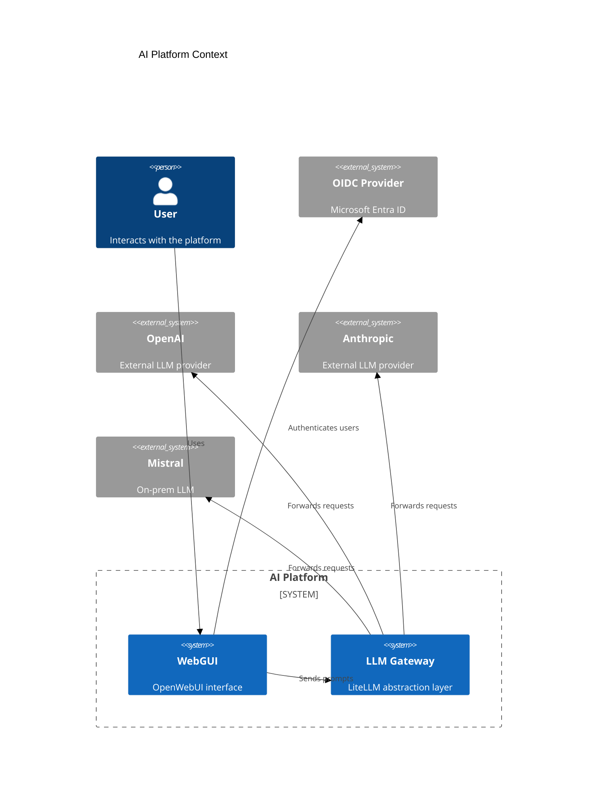
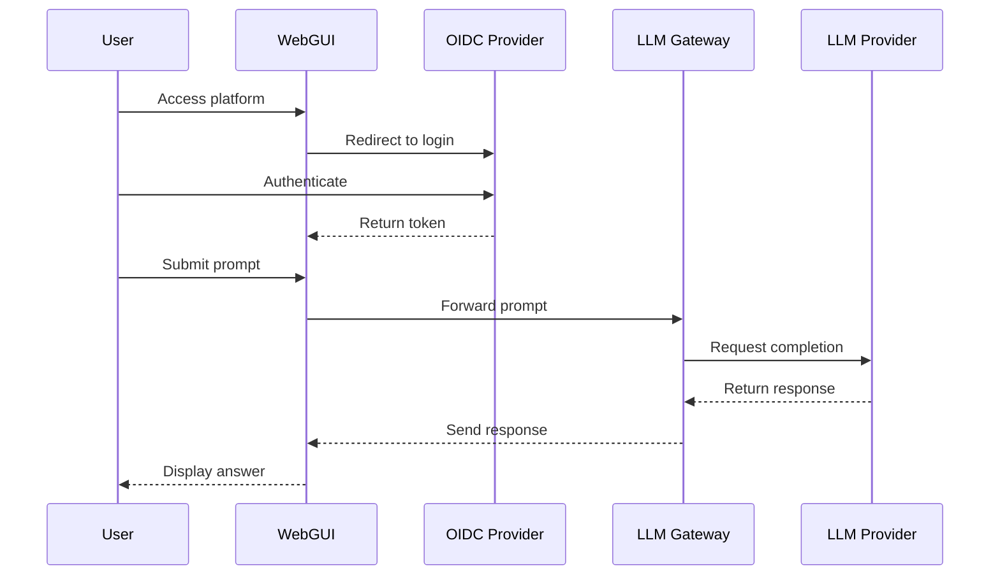

# AI Platform Architecture

This document describes an AI Platform that exposes AI capabilities through a web interface, authenticates users via an OIDC provider, and routes requests through a gateway that abstracts external language models.

## Components

- **WebGUI**: User-facing interface built on OpenWebUI.
- **Identity Provider**: OIDC-compliant service (e.g., Microsoft Entra ID) that authenticates users for the WebGUI.
- **LLM Gateway**: Abstraction layer based on LiteLLM that routes requests to different model providers.
- **External Providers**: Managed or self-hosted large language models such as OpenAI, Anthropic, Gemini, or on-premise models like Mistral.

## Context Diagram

## Interaction Sequence

